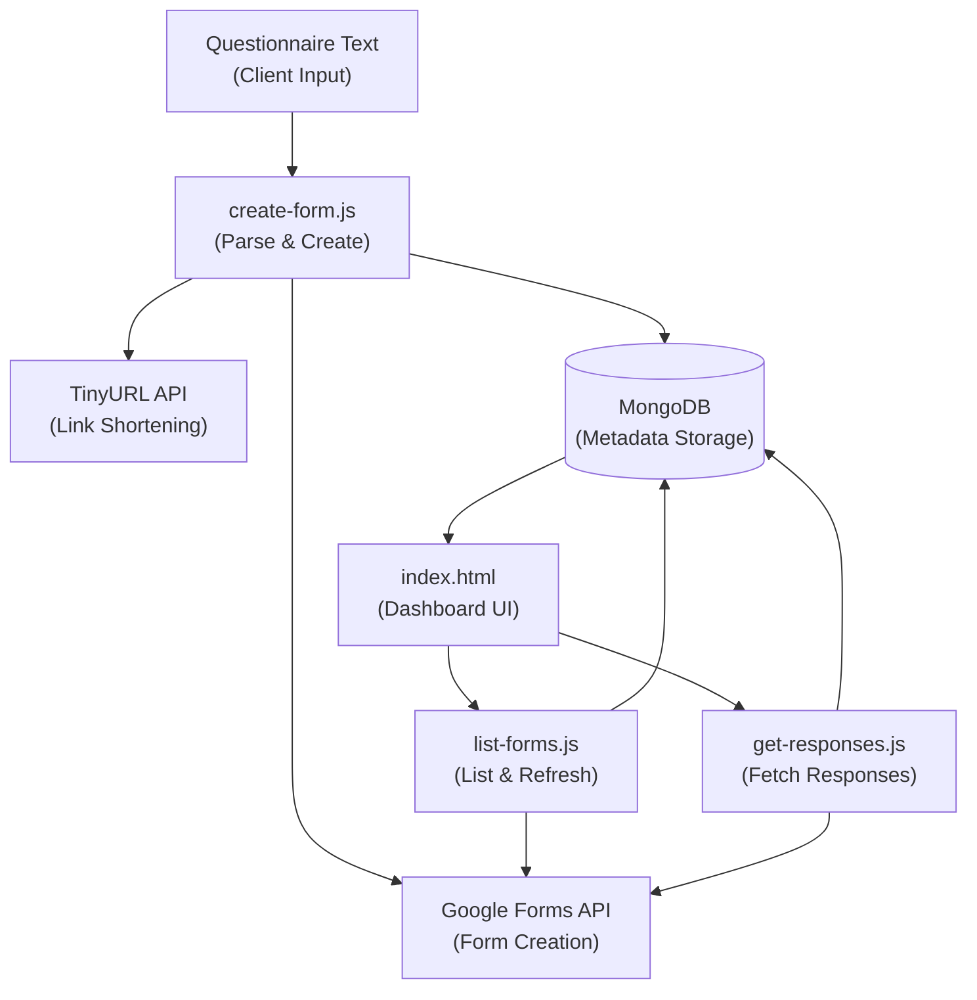

# DreamShift Form Studio


DreamShift Form Studio is a private, production-grade form automation platform built to turn pasted questionnaire text into Google Forms, persist form metadata and response counts in MongoDB, and provide a unified client dashboard for reviewing responses.

It brings together:

- Automated Google Form creation from plain-text questionnaires
- Client form dashboard with response counts and metadata tracking
- Live response viewer with human-readable question mapping
- Automatic URL shortening through TinyURL
- Serverless architecture for zero infrastructure overhead
- OAuth 2.0 authentication with service account fallback

Built and engineered by **Navodhya Fernando**.

---

## Features

### Form Dashboard

The landing page displays all saved client forms as visual cards, showing client name, form title, question count, response count, and creation date at a glance.

### New Form Workflow

Click **New Form** to open a modal where you enter a client name, optional form title, and paste questionnaire text. The app parses the text, creates the Google Form, shortens the responder link, and saves all metadata to MongoDB in a single operation.

### Response Viewer

Click a saved form card to open the response modal, which displays:

- Editable Google Forms link
- Shareable responder link
- One-click URL copy action
- Live response table updated from the Google Forms API
- Question titles automatically mapped to response answers

### Automatic URL Shortening

Responder links are shortened via TinyURL for cleaner sharing. If shortening fails, the system gracefully falls back to the original Google Forms URL.

---

## Benefits

- **Instant Form Generation:** Convert questionnaire templates into Google Forms without manual field creation
- **Centralized Dashboard:** Track all client forms, response counts, and metadata in one unified view
- **Live Reporting:** Response data is always fresh, pulled directly from Google Forms on demand
- **Low Operational Cost:** Serverless architecture means zero database overhead and pay-per-request pricing
- **Seamless Sharing:** Shortened URLs reduce friction when distributing surveys to respondents
- **Secure Storage:** Form metadata and credentials are encrypted and access-controlled via MongoDB

---

## Tech Stack

### Frontend

- Netlify (static hosting)
- Vanilla JavaScript / HTML / CSS
- Single-page application architecture

### Serverless Backend

- Netlify Functions
- Node.js 18+

### External APIs

- Google Forms API v1
- TinyURL API

### Data Layer

- MongoDB Atlas
- Form metadata persistence

---

## Why This Project Reflects My Engineering Profile

- Full-stack ownership spanning frontend UI, serverless function logic, and external API integration
- Production-grade error handling and OAuth authentication with fallback strategies
- Clean separation of concerns: parsing logic, function orchestration, and client-side rendering
- Real-world problem solving: questionnaire-to-form parsing, response mapping, and URL shortening workflows
- Scalable architecture designed for multi-tenant, multi-form scenarios

---

## System Architecture

### Architecture Components




---

## How Data Flows

1. A user enters a client name, optional form title, and questionnaire text in the **New Form** modal on the frontend.

2. The frontend sends the payload to `netlify/functions/create-form.js`, which parses each questionnaire line into structured Google Form questions following the defined format.

3. `create-form.js` calls the Google Forms API to create the form, retrieves the responder link, shortens it via TinyURL, and saves the complete form metadata (formId, clientName, title, links, response count, question structure) to MongoDB.

4. `netlify/functions/list-forms.js` retrieves all saved forms from MongoDB and refreshes the response count from Google Forms in the background, ensuring the dashboard always displays current data.

5. `netlify/functions/get-responses.js` fetches live responses for a selected form from Google Forms, maps response answer IDs back to human-readable question titles using metadata from MongoDB, and returns a formatted response table.

6. `index.html` renders the form dashboard, modals, and response table entirely on the client, making API calls to the three serverless functions as needed.

---

## Repository Structure

```plaintext
ds-form-builder/
  index.html
    Single-page dashboard UI with modals and client-side state management

  package.json
    Dependencies and dev scripts

  netlify.toml
    Netlify build and function configuration

  .env.example
    Environment variable template (OAuth and MongoDB credentials)

  .gitignore
    Local-only files and raw data exclusions

  LICENSE
    Private and proprietary license

  netlify/
    functions/
      create-form.js
        Parse questionnaire text, create Google Form, shorten URL, save metadata

      list-forms.js
        Retrieve saved forms from MongoDB, refresh response counts

      get-responses.js
        Fetch live responses from Google Forms and map to readable questions
```

---

## Quick Start

### Prerequisites

Make sure you have the following installed:

- Node.js 18+
- npm
- A MongoDB Atlas cluster with connection URI
- Google OAuth 2.0 credentials (client ID, client secret, refresh token)

---

## Installation and Setup

### 1. Install Dependencies

```bash
npm install
```

### 2. Set Up Environment Variables

Copy `.env.example` to `.env` and fill in the values:

```bash
cp .env.example .env
```

**Google OAuth (preferred):**

```plaintext
GOOGLE_CLIENT_ID=<your-client-id>
GOOGLE_CLIENT_SECRET=<your-client-secret>
GOOGLE_REFRESH_TOKEN=<your-refresh-token>
```

**MongoDB:**

```plaintext
MONGODB_URI=<your-connection-string>
MONGODB_DB=dreamshift
```

---

## Running the App

### Start the Local Development Server

```bash
npm run dev
```

Netlify Dev will serve the app and functions locally, typically at `http://localhost:8888`.

---

## Questionnaire Format

Each line in the questionnaire text should follow one of these patterns:

```text
Question text - TEXT
Question text - PARAGRAPH_TEXT
Question text - MULTIPLE_CHOICE - Option 1, Option 2, Option 3
Question text - CHECKBOX - Option 1, Option 2
Question text - DROPDOWN - Option 1, Option 2, Option 3
Question text - SCALE - 1, 5, Low, High
```

Blank lines are ignored. Lines beginning with `#` are treated as comments and will be skipped.

---

## Authentication

### Preferred: Google OAuth Refresh Token

The serverless functions automatically use OAuth 2.0 refresh tokens when these environment variables are present:

- `GOOGLE_CLIENT_ID`
- `GOOGLE_CLIENT_SECRET`
- `GOOGLE_REFRESH_TOKEN`

This is the recommended approach for personal Google accounts and local development.

### Fallback: Service Account JSON

If you need domain-wide delegation or are using a Google Workspace account, set:

- `GOOGLE_SERVICE_ACCOUNT_KEY` (full JSON blob)
- `GOOGLE_IMPERSONATE_EMAIL` (optional, for Google Workspace delegation)

The functions will automatically fall back to service account auth if OAuth credentials are not present.

---

## Data Storage Notes

- **Form Metadata:** Client name, form title, question count, response count, shortener link, and the Google Forms ID are persisted in MongoDB.
- **Response Data:** Responses are fetched live from the Google Forms API on demand and are not stored in MongoDB.
- **Questionnaire Parsing:** Raw questionnaire text is parsed on each form creation; the parsed structure is stored as part of the form metadata for reference.

---

## Build and Deployment

### Test Build

```bash
npm run build
```

This validates the code and dependencies without deploying.

### Deploy to Netlify

1. Push the repository to GitHub.
2. Import the repository into Netlify.
3. Set the publish directory to `.`
4. Add the required environment variables in the Netlify dashboard (OAuth credentials, MongoDB URI).
5. Deploy with `netlify/functions` enabled.

---

## Security and Access Notes

This repository uses a strict `.gitignore` to protect sensitive credentials and local configuration.

The following files should remain private and excluded from Git:

```plaintext
.env
node_modules/
.netlify/
.DS_Store
```

Only sanitized `.env.example` and function code are committed. OAuth tokens, service account keys, and MongoDB credentials are never stored in version control.

---

## License

This software is private and proprietary. See [LICENSE](LICENSE) for usage restrictions.

